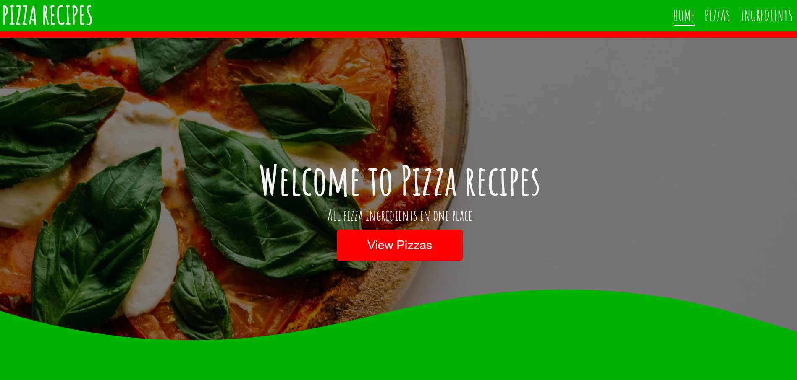

# PizzaRecipes

This project was created using the Angular framework using Services and data binding for cross-component communication.

## Functionalities

-**choose a pizza recipe with ingredients**  
-**add ingredients to the shopping list**  
-**remove ingredients from the shopping list**  
-**edit ingredients from the shopping list**

## How to use it

-**clone the repo https://github.com/Danijela2019/pizza-recipes.git**  
-**instal all dependencies by runnig 'npm install'in the terminal**  
-**start the application by typing 'ng serve' in the terminal**  
-**view the app in your browser at http://localhost:4200**
